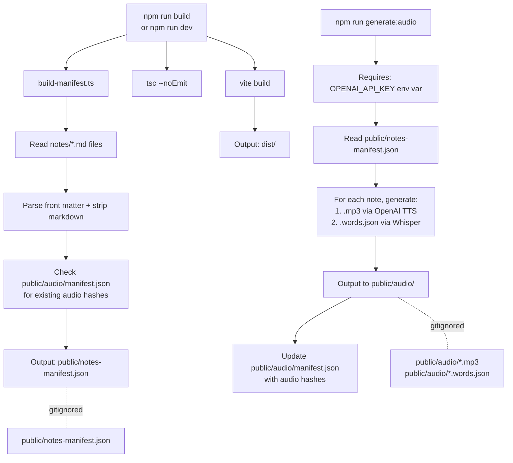

<div align="center">

# AI Codex

**A modern, offline-first PWA for exploring AI & Claude development notes.**

[](https://www.typescriptlang.org/)
[](https://vitejs.dev/)
[](https://vitest.dev/)
[](https://biomejs.dev/)
[](LICENSE)

[Getting Started](#getting-started) · [npm Scripts](#npm-scripts) · [Agent Ingestion](#agent-ingestion) · [TTS Audio Generation](#tts-audio-generation) · [Architecture](#architecture) · [PWA & Offline](#pwa--offline) · [Security](#security) · [Notes Curriculum](#notes-curriculum) · [Contributing](CONTRIBUTORS.md) · [Changelog](CHANGELOG.md)

</div>

---

## Overview

41 structured Markdown notes covering the Claude and AI development ecosystem, served by a fast TypeScript + Vite single-page app. Notes are the single source of truth — the app shell stays lean and fetches content lazily at runtime. Full-text search works immediately from a build-time manifest, and every visited note is cached for offline access.

## What's in this repo

```
ai-codex/
├── notes/                        ← Source of truth — 41 Markdown course notes
├── src/                          ← TypeScript app source
│   ├── main.ts                   ← Entry point
│   ├── types.ts                  ← Shared interfaces
│   ├── data.ts                   ← NOTES array (derived from manifest at runtime)
│   ├── state.ts                  ← App state management
│   ├── utils.ts                  ← Pure helpers (reading time, slugify, etc.)
│   ├── render.ts                 ← DOM rendering (nav, content, welcome grid)
│   ├── navigation.ts             ← Note navigation and history
│   ├── search.ts                 ← Fuse.js integration
│   ├── search.worker.ts          ← Web Worker: builds search index off main thread
│   ├── ui.ts                     ← UI interactions (theme, keyboard, tags)
│   ├── tts.ts                    ← Web Speech API fallback engine
│   ├── audio-player.ts           ← HTMLAudioElement engine with word-level rAF highlight
│   └── tts-ui.ts                 ← TTS controls UI (engine factory, stale warning)
├── public/                       ← Static assets served as-is
│   ├── notes/                    ← .md files served at /notes/*.md (for runtime fetch)
│   ├── audio/                    ← Generated audio (gitignored except manifest.json)
│   ├── icons/                    ← PWA icons (SVG, 192 × 192 and 512 × 512)
│   ├── manifest.json             ← PWA manifest
│   ├── notes-manifest.json       ← Build-time generated search index + metadata
│   └── sw.js                     ← Service worker (vanilla JS)
├── tests/                        ← Vitest specs
├── scripts/
│   ├── build-manifest.ts         ← Generates notes-manifest.json at build time
│   ├── generate-audio.ts         ← Orchestrates OpenAI TTS + Whisper for all notes
│   └── audio/
│       ├── extract-text.ts       ← Strips markdown, expands acronyms for TTS
│       ├── tts-openai.ts         ← POST /v1/audio/speech → validates → writes .mp3
│       ├── transcribe-whisper.ts ← POST /v1/audio/transcriptions → word timestamps
│       └── format-words.ts       ← Normalises Whisper response → [{word,start,end}]
├── dist/                         ← Vite build output (gitignored)
├── index.html                    ← Lean app shell
├── style.css                     ← App styles
├── vite.config.ts
├── tsconfig.json
├── biome.json
├── package.json
├── vercel.json                   ← CSP + security headers for Vercel CDN
├── serve.json                    ← CSP + security headers for `npx serve` (local)
├── CHANGELOG.md
├── CODE_OF_CONDUCT.md
├── CONTRIBUTORS.md
└── SECURITY.md
```

---

## Getting Started

### Prerequisites

- **Node.js** ≥ 20
- **npm** ≥ 10

### Installation

```bash
git clone https://github.com/your-username/ai-codex.git
cd ai-codex
npm install
```

### Development

```bash
npm run dev
# → http://localhost:5173 with HMR
```

The manifest is auto-generated before the dev server starts. Any change to a `.md` file in `notes/` is reflected after restarting the dev server.

### Production Build

```bash
npm run build
# → dist/
```

### Preview the Build

```bash
npm run preview
# → http://localhost:4173
```

### Install as a PWA

Service workers require HTTP/HTTPS. Build the app and serve the output:

```bash
npm run build
npx serve dist/
# Open http://localhost:3000 → click the install icon in the address bar
```

All notes are cached after first access. Subsequent loads work fully offline.

---

## Features

| Feature                | Details                                                       |
| ---------------------- | ------------------------------------------------------------- |
| 41 structured notes    | Progressive learning path through the Claude and AI ecosystem |
| Fuzzy full-text search | Fuse.js index built on a Web Worker — non-blocking            |
| Lazy note loading      | Notes are fetched on demand and cached in memory              |
| Collapsible sections   | Auto-generated from heading structure                         |
| Table of contents      | In-page navigation with scroll-spy                            |
| Related notes panel    | Surfaced by tag and content similarity                        |
| Text-to-speech         | Built-in TTS reader with rate and voice controls              |
| Dark / light theme     | Persisted across sessions                                     |
| Offline PWA            | Installable; all visited notes cached by the Service Worker   |

---

## npm Scripts

| Script                   | Description                                                                                       |
| ------------------------ | ------------------------------------------------------------------------------------------------- |
| `npm run dev`            | Start Vite dev server with HMR (generates manifest first)                                         |
| `npm run build`          | Generate manifest → type-check → Vite production build                                            |
| `npm run build:manifest` | Regenerate `public/notes-manifest.json` from `notes/` without a full build                        |
| `npm run preview`        | Preview the production build locally                                                              |
| `npm test`               | Run the full Vitest suite                                                                         |
| `npm run test:watch`     | Run tests in watch mode                                                                           |
| `npm run typecheck`      | Type-check with `tsc --noEmit`                                                                    |
| `npm run lint`           | Biome — check linting and formatting                                                              |
| `npm run lint:fix`       | Biome — auto-fix lint and formatting                                                              |
| `npm run format`         | Biome — format all files                                                                          |
| `npm run ingest`         | Agent ingestion CLI (see [Agent Ingestion](#agent-ingestion))                                     |
| `npm run generate:audio` | Generate `.mp3` + `.words.json` for all notes (see [TTS Audio Generation](#tts-audio-generation)) |

---

## Agent Ingestion

A secure, agent-based CLI pipeline that fetches one or more webpages (or generates content from a topic), summarises them with Claude, and writes validated Markdown drafts to `notes/drafts/` for human review. Supports combining multiple sources into a single note, controlling note length, and graceful cancellation with Ctrl+C.

### How It Works

```
--url="url" / --urls="a,b,c" / --topic
      ↓
  fetch.ts       ← HTTPS-only, 10s timeout, 2 retries
      ↓
  sanitize.ts    ← strips scripts/iframes, extracts readable text
      |
  ┌───┴──────────────────────────────────────────────┐
  │ --combine: concatenate all sources, one API call │
  │ default:   one API call per URL                  │
  └───┬──────────────────────────────────────────────┘
      ↓
  summarize.ts   ← Claude API call with prompt-injection safeguards
                   (--role lens applied, --length constraints injected)
      ↓
  format.ts      ← renders YAML frontmatter + structured Markdown note
      ↓
  validate.ts    ← checks frontmatter, slug uniqueness, content length, unsafe patterns
      ↓
  save.ts        ← writes notes/drafts/{slug}.md — never overwrites
      ↓
  logger.ts      ← appends to logs/ingest.log and logs/error.log
```

### Usage

```bash
# Single URL
npm run ingest -- --url="https://example.com/article"

# Multiple URLs — repeated flag, produces one draft per URL
npm run ingest -- --url="https://a.com" --url="https://b.com"

# Multiple URLs — comma-separated, combine into one draft
npm run ingest -- --urls="https://a.com,https://b.com" --combine

# Repeated flags also work with --combine
npm run ingest -- --url="https://a.com" --url="https://b.com" --combine

# From a topic (no URL fetch — LLM generates from the topic alone)
npm run ingest -- --topic="Model Context Protocol"

# Control note length
npm run ingest -- --url="https://example.com" --length=short
npm run ingest -- --url="https://example.com" --length=medium
npm run ingest -- --url="https://example.com" --length=long

# With a specific analysis lens
npm run ingest -- --url="https://example.com" --role=security

# Combine flags
npm run ingest -- --urls="https://a.com,https://b.com" --combine --length=long --role=research

# Enable debug output
npm run ingest -- --url="https://example.com" --debug

# Cancel at any time with Ctrl+C — aborts the in-flight Claude request cleanly
```

### CLI Flags

| Flag              | Description                                                                              |
| ----------------- | ---------------------------------------------------------------------------------------- |
| `--url=<url>`     | Single URL to ingest. Repeatable: `--url=a --url=b` produces one draft per URL.          |
| `--urls=<urls>`   | Comma-separated URLs (e.g. `--urls="a.com,b.com"`). Use with `--combine`. Max 3 total.   |
| `--topic=<text>`  | Generate a note directly from a topic description (no URL fetch)                         |
| `--combine`       | Merge all URL sources into one unified draft instead of one draft per URL                |
| `--length=<size>` | Note length: `short` (~3 min read), `medium` (default, ~5–8 min), `long` (~12–20 min)    |
| `--role=<role>`   | Analysis lens: `llm` (default), `security`, `frontend`, `backend`, `research`, `product` |
| `--debug`         | Echo log entries to stdout/stderr                                                        |

### Setup

1. Create a `.env` file in the project root (already gitignored):

```bash
CLAUDE_API_KEY=sk-ant-...
```

2. Run the CLI — drafts appear in `notes/drafts/`.
3. Review the draft, move it to `notes/` with the correct numeric prefix, then run `npm run build`.

### Security Model

- Only `https:` URLs are accepted (no `http:`, `file:`, `data:`, `javascript:`)
- Maximum 3 URLs per run
- Slugs with path traversal sequences (`..`, `/`, `\`, null bytes) are rejected
- Output path is resolved and asserted to stay inside `notes/drafts/`
- Existing files are never overwritten
- All LLM prompts explicitly instruct the model to treat input content as untrusted data
- HTML is sanitised (scripts, iframes, inline event handlers stripped) before the LLM sees it

### Logs

All runs are logged to the `logs/` directory (gitignored):

| File              | Contents                                        |
| ----------------- | ----------------------------------------------- |
| `logs/ingest.log` | Successful saves and run events                 |
| `logs/error.log`  | Fetch, summarise, save, and validation failures |

---

## Architecture

### Note Loading Flow

Notes are fetched lazily — only when a user opens them. The search index is populated from a pre-built manifest so search is available immediately without loading all 37 files at startup.

```
App init
  ↓
fetch("/notes-manifest.json")       ← pre-cached by SW (~50 KB)
  ↓
Build Fuse.js index (Web Worker)    ← off the main thread, non-blocking
  ↓
User opens a note
  ↓
noteContentCache.get(slug)?
  ├── hit  → render immediately
  └── miss → fetch("/notes/{slug}.md")
               ↓
             parse front matter → render markdown → cache
```

### Build-time Manifest

`scripts/build-manifest.ts` runs before every dev/build. It reads all `.md` files, parses front matter, strips markdown to plain text for Fuse.js, and writes `public/notes-manifest.json`. The content hash auto-patches the `CACHE_VERSION` in the Service Worker — no manual bumps needed.

```jsonc
{
  "version": "sha256-abc123",
  "notes": [
    {
      "id": "note-01",
      "slug": "01-ai-fluency-framework",
      "emoji": "🧠",
      "title": "AI Fluency Framework",
      "tags": ["4Ds", "delegation"],
      "content": "Plain text for Fuse.js search index…",
    },
  ],
}
```

### Build & Audio Generation Flow



### Toolchain

| Tool                                             | Role                                            |
| ------------------------------------------------ | ----------------------------------------------- |
| [Vite 6](https://vitejs.dev/)                    | Dev server, bundler, sourcemaps                 |
| [TypeScript 5](https://www.typescriptlang.org/)  | Strict type-checking across all source files    |
| [Vitest 3](https://vitest.dev/)                  | Unit tests with jsdom environment               |
| [Biome 2](https://biomejs.dev/)                  | Linter + formatter (replaces ESLint + Prettier) |
| [marked](https://marked.js.org/)                 | Markdown → HTML rendering                       |
| [highlight.js](https://highlightjs.org/)         | Syntax highlighting                             |
| [DOMPurify](https://github.com/cure53/DOMPurify) | HTML sanitisation                               |
| [Fuse.js](https://www.fusejs.io/)                | Client-side fuzzy search                        |

---

## PWA & Offline

### Service Worker

Three-tier cache strategy — all dependencies are bundled locally, no CDN:

| Request type                                | Strategy                            | Why                                               |
| ------------------------------------------- | ----------------------------------- | ------------------------------------------------- |
| Core assets (`index.html`, manifest, icons) | Cache-first, pre-cached on install  | Stable; enables instant load                      |
| Vite-hashed JS/CSS bundles                  | Cache-first, cached on first access | Content-addressed — safe to cache indefinitely    |
| Note `.md` files                            | Stale-while-revalidate              | Serve from cache instantly; refresh in background |

### Web Worker

The Fuse.js search index is built on a background thread so the main thread stays responsive during startup. Falls back gracefully to main-thread indexing on unsupported browsers.

---

## Security

All runtime dependencies are npm packages bundled by Vite. There are no third-party CDN script tags and no Subresource Integrity hashes to maintain.

### Content Security Policy

Enforced via `serve.json` and mirrored in the `<meta http-equiv>` tag in `index.html`:

```
default-src 'self';
script-src  'self';
style-src   'self' 'unsafe-inline';
img-src     'self' data:;
font-src    'self';
connect-src 'self';
object-src  'none';
base-uri    'self';
frame-ancestors 'none';
```

| Directive         | Value                    | Rationale                           |
| ----------------- | ------------------------ | ----------------------------------- |
| `script-src`      | `'self'`                 | All JS bundled locally — no CDN     |
| `connect-src`     | `'self'`                 | Required for `fetch("/notes/*.md")` |
| `style-src`       | `'self' 'unsafe-inline'` | highlight.js applies inline styles  |
| `frame-ancestors` | `'none'`                 | Prevents clickjacking               |

See [SECURITY.md](SECURITY.md) for the full security posture and vulnerability reporting process.

---

## Notes Curriculum

41 notes covering a progressive learning path:

| #   | Topic                                                                 |
| --- | --------------------------------------------------------------------- |
| 01  | AI Fluency Framework (Anthropic's 4Ds)                                |
| 02  | AI/ML Technical Concepts                                              |
| 03  | Prompt Engineering                                                    |
| 04  | Claude Code Basics                                                    |
| 05  | Claude Code Workflow                                                  |
| 06  | Custom Commands & MCP                                                 |
| 07  | Hooks & SDK                                                           |
| 08  | Commands Glossary                                                     |
| 09  | Claude with Playwright                                                |
| 10  | Screenshot Tools                                                      |
| 11  | Deep Learning Resources                                               |
| 12  | Attention Is All You Need (Transformers paper)                        |
| 13  | Claude Models Guide                                                   |
| 14  | Prompt Templates                                                      |
| 15  | RAG (Retrieval-Augmented Generation)                                  |
| 16  | AI Agents                                                             |
| 17  | The AI Landscape                                                      |
| 18  | AI Safety & Alignment                                                 |
| 19  | Embeddings & Vector Search                                            |
| 20  | Multimodal AI                                                         |
| 21  | Building a RAG App                                                    |
| 22  | AI Models Benchmark                                                   |
| 23  | Constitutional AI & RLHF                                              |
| 24  | Embeddings & Vector Databases                                         |
| 25  | AI Evaluation Benchmarks                                              |
| 26  | AI Agents in Production                                               |
| 27  | AI Safety Red Teaming                                                 |
| 28  | Fine-Tuning vs Prompting vs RAG                                       |
| 29  | LLM Frameworks Overview                                               |
| 30  | AI App Security Checklist                                             |
| 31  | Multimodal & Agentic Trends 2025–2026                                 |
| 32  | Future of AI Development                                              |
| 33  | Claude Tool Use                                                       |
| 34  | Claude Vision & Multimodal                                            |
| 35  | Claude Extended Thinking                                              |
| 36  | Claude Projects & Memory                                              |
| 37  | Claude API Cost Optimisation                                          |
| 38  | AI Coding Assistant Landscape — Architecture, Pricing & How to Choose |
| 39  | Hugging Face — The GitHub of AI                                       |
| 40  | The Agentic AI Revolution — A Beginner's Explainer                    |
| 41  | Self-Hosting Open-Source LLMs — Ollama & vLLM for GDPR Compliance     |

---

## TTS Audio Generation

A build-time CLI pipeline that converts every note into high-quality narrated audio using the OpenAI TTS and Whisper APIs. Audio files are **not committed to the repo** — they are generated locally for development, and re-generated in CI on every push to `main` before deploying to Vercel. The script is hash-aware: unchanged notes are always skipped, so re-runs cost nothing.

### What lives where

| File                             | In git? | Note                                                                                  |
| -------------------------------- | ------- | ------------------------------------------------------------------------------------- |
| `public/audio/manifest.json`     | ✅ Yes  | ~2 kB. Per-note content hashes used by CI cache and the frontend stale-warning check. |
| `public/audio/{slug}.mp3`        | ❌ No   | ~3 MB per note. Generated locally or in CI. Gitignored.                               |
| `public/audio/{slug}.words.json` | ❌ No   | Whisper word timestamps for real-time highlighting. Generated alongside the mp3.      |

### How It Works

```
npm run generate:audio
      │
      ├─ pregenerate:audio
      │       └─ build:manifest  ← regenerates notes-manifest.json before audio runs
      │
      ├─ generate-audio.ts  (orchestrator)
      │       ↓
      │   reads public/notes-manifest.json
      │       ↓
      │   for each note:
      │     compute SHA-256 of extractSpeechText(note.md)
      │     compare against public/audio/manifest.json entry
      │       ├─ hash matches + .mp3 exists → SKIP (zero API cost)
      │       └─ hash changed or no .mp3 yet → GENERATE
      │               ↓
      │           scripts/audio/extract-text.ts
      │               strips front matter, code blocks, inline code
      │               expands acronyms (LLM → L L M, RAG → R A G …)
      │               ↓
      │           scripts/audio/tts-openai.ts
      │               POST /v1/audio/speech (tts-1-hd, voice: ash)
      │               validates MIME type + minimum byte size
      │               writes public/audio/{slug}.mp3
      │               ↓
      │           scripts/audio/transcribe-whisper.ts
      │               POST /v1/audio/transcriptions (whisper-1, word timestamps)
      │               ↓
      │           scripts/audio/format-words.ts
      │               normalises → [{word, start, end}]
      │               writes public/audio/{slug}.words.json
      │               ↓
      │           updates public/audio/manifest.json entry
      │
      └─ postgenerate:audio
              └─ build:manifest  ← re-runs so notes-manifest.json gains hasAudio: true
```

### Usage

```bash
# Generate audio for all notes (first run — ~$9 one-time cost)
OPENAI_API_KEY=sk-... npm run generate:audio

# Generate audio for specific notes only (prefix match on slug)
OPENAI_API_KEY=sk-... npm run generate:audio -- --notes=01
OPENAI_API_KEY=sk-... npm run generate:audio -- --notes=01,02,03

# Force regeneration even if the note is unchanged
OPENAI_API_KEY=sk-... npm run generate:audio -- --notes=01 --force

# Use a different OpenAI voice
OPENAI_API_KEY=sk-... npm run generate:audio -- --voice=nova

# Re-run after editing notes — unchanged notes are skipped automatically
OPENAI_API_KEY=sk-... npm run generate:audio

# After generation, commit the updated hash manifest
git add public/audio/manifest.json
git commit -m "chore(notes): update audio manifest"
git push
```

### CLI Flags

| Flag                 | Description                                                                                                             |
| -------------------- | ----------------------------------------------------------------------------------------------------------------------- |
| `--notes=<prefixes>` | Comma-separated slug prefixes to process. e.g. `--notes=01,02`. Omit to process all 39 notes.                           |
| `--force`            | Overwrite existing `.mp3` and `.words.json` files even if the content hash is unchanged.                                |
| `--voice=<name>`     | OpenAI TTS voice. Default: `ash`. Options: `alloy`, `ash`, `coral`, `echo`, `fable`, `nova`, `onyx`, `sage`, `shimmer`. |

### Setup

1. Obtain an OpenAI API key at [platform.openai.com/api-keys](https://platform.openai.com/api-keys).

2. Set the key in your shell (do not commit it):

   ```bash
   export OPENAI_API_KEY=sk-...
   # or prefix each command: OPENAI_API_KEY=sk-... npm run generate:audio
   ```

3. Run generation for one note to verify everything works:

   ```bash
   npm run generate:audio -- --notes=01
   ```

4. Open the dev server and confirm note 01 plays with the AudioPlayer (not Web Speech API):

   ```bash
   npm run dev
   ```

5. When satisfied, generate all notes and commit the manifest:
   ```bash
   npm run generate:audio
   git add public/audio/manifest.json
   git commit -m "chore(notes): generate audio for all notes"
   git push
   ```

### Security Model

- `OPENAI_API_KEY` is read from `process.env` only — never accepted as a CLI flag or hardcoded
- Output path is resolved and asserted to remain inside `public/audio/` — path traversal via crafted slugs is rejected
- API response is validated before writing: `Content-Type` must be `audio/mpeg` and body must be > 1 kB
- Existing files are never overwritten unless `--force` is passed explicitly
- Maximum 39 notes per run — no unbounded loops

### CI/CD integration

On every push to `main`, the `audio-deploy.yml` GitHub Actions workflow:

1. **Restores the audio cache** — keyed on `notes/**/*.md` content hash. If no notes changed, audio is restored from cache and generation is skipped entirely (~$0).
2. **Generates** — runs `npm run generate:audio`. Only new or changed notes call the OpenAI API (~$0.20 per note).
3. **Builds** — `vercel build --prod` runs `npm run build`; Vite copies `public/audio/` → `.vercel/output/static/audio/`.
4. **Deploys** — `vercel deploy --prebuilt --prod` uploads to the Vercel CDN. Audio is live.

> **Cost model:** A typical non-note commit (style fix, README update) costs ~$0. One edited note costs ~$0.20. A full cold-cache regeneration costs ~$9 (one-time).

Add these two secrets in **GitHub → Settings → Secrets and variables → Actions**:

| Secret           | Where to get it                                                      |
| ---------------- | -------------------------------------------------------------------- |
| `OPENAI_API_KEY` | [platform.openai.com/api-keys](https://platform.openai.com/api-keys) |
| `VERCEL_TOKEN`   | [vercel.com/account/tokens](https://vercel.com/account/tokens)       |

`VERCEL_ORG_ID` and `VERCEL_PROJECT_ID` are **not** required as secrets — they live in `.vercel/project.json` (committed to git after running `vercel link` locally).

> **Important:** Once `audio-deploy.yml` is live, **disable Vercel's automatic GitHub integration** (Vercel → Project → Settings → Git → disable "Deploy on push"). Otherwise Vercel deploys on every push without audio, before GHA has a chance to generate it.

---

## Contributing

Contributions are welcome — whether that's fixing a bug, adding a note, or improving the app. Please read [CONTRIBUTORS.md](CONTRIBUTORS.md) before opening a pull request.

This project follows the [Contributor Covenant Code of Conduct](CODE_OF_CONDUCT.md). By participating, you agree to uphold it.

---

## Changelog

See [CHANGELOG.md](CHANGELOG.md) for a full history of releases and notable changes.

---

## License

Distributed under the [ISC License](LICENSE).

---

<div align="center">
  <sub>Built by GadDev · April 2026</sub>
</div>
