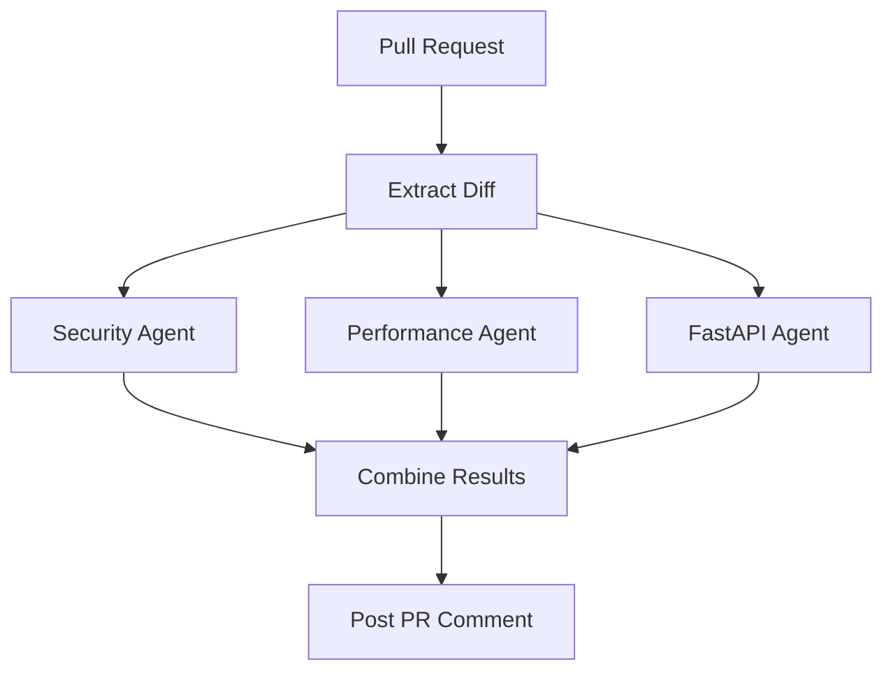

# 🤖 Claude Multi-Agent Code Review (GitHub Actions)


A **production-ready multi-agent AI code review system** powered by Claude, designed for GitHub Actions.

> Replace generic AI reviews with **specialized agents** for security, performance, and architecture.

---

## 📚 Table of Contents

- [✨ Features](#-features)
- [🧠 Architecture](#-architecture)
- [🚀 Quick Start](#-quick-start)
- [⚙️ Full Workflow](#️-full-workflow)
- [🔐 Security](#-security)
- [🧩 Enhancements](#-enhancements)
- [📊 Why This Works](#-why-this-works)
- [✅ Checklist](#-checklist)
- [📌 Summary](#-summary)

---

## ✨ Features

- 🔐 **Security-focused reviews**
- ⚡ **Performance analysis**
- 🚀 **FastAPI best practices**
- 🧠 **Multi-agent architecture**
- 💬 **Automated PR comments**
- 🛡️ **Secure-by-design pipeline**
- 📦 **Artifact storage & audit trail**
- ❌ **Optional merge blocking**

---

## 🧠 Architecture

### Agents

| Agent | Focus |
|------|------|
| 🔐 Security Reviewer | Vulnerabilities, auth, secrets |
| ⚡ Performance Reviewer | Latency, async, scalability |
| 🚀 FastAPI Specialist | API design, Pydantic v2 |

### Flow



---

## 🚀 Quick Start

### 1. Add Secret

Go to your repo → **Settings → Secrets → Actions**

```
ANTHROPIC_API_KEY=your_api_key_here
```

---

### 2. Create Workflow

```
.github/workflows/claude-review.yml
```

---

### 3. Paste Workflow (see below)

---

### 4. Open a PR → Get AI Review 🎉

---

## ⚙️ Full Workflow

<details>
<summary>📄 Click to expand full GitHub Actions workflow</summary>

```yaml
name: Claude Multi-Agent Review

on:
  pull_request:
    types: [opened, synchronize]

permissions:
  contents: read
  pull-requests: write

jobs:
  review:
    runs-on: ubuntu-latest

    steps:
      - uses: actions/checkout@v4

      - name: Get PR diff (safe)
        run: |
          git fetch origin main
          git diff origin/main...HEAD \
            ':!*.env' ':!secrets/*' > diff.txt
          head -c 60000 diff.txt > safe_diff.txt

      # 🔐 SECURITY AGENT
      - name: Security Review
        env:
          ANTHROPIC_API_KEY: ${{ secrets.ANTHROPIC_API_KEY }}
        run: |
          curl https://api.anthropic.com/v1/messages \
            -H "x-api-key: $ANTHROPIC_API_KEY" \
            -H "anthropic-version: 2023-06-01" \
            -H "content-type: application/json" \
            -d @- <<EOF > security.json
          {
            "model": "claude-3-5-sonnet-20241022",
            "max_tokens": 800,
            "messages": [{
              "role": "user",
              "content": "You are a senior security engineer. Review this git diff for vulnerabilities, auth issues, input validation problems, and secrets exposure.\n\nOutput format:\n🔴 Critical Issues\n🟡 Risks & Warnings\n✅ Security Best Practices Found\n\nDiff:\n$(cat safe_diff.txt)"
            }]
          }
          EOF

      # ⚡ PERFORMANCE AGENT
      - name: Performance Review
        env:
          ANTHROPIC_API_KEY: ${{ secrets.ANTHROPIC_API_KEY }}
        run: |
          curl https://api.anthropic.com/v1/messages \
            -H "x-api-key: $ANTHROPIC_API_KEY" \
            -H "anthropic-version: 2023-06-01" \
            -H "content-type: application/json" \
            -d @- <<EOF > perf.json
          {
            "model": "claude-3-5-sonnet-20241022",
            "max_tokens": 800,
            "messages": [{
              "role": "user",
              "content": "You are a performance engineer. Review this diff for slow queries, blocking I/O, improper async usage, and scalability issues.\n\nOutput format:\n🔴 Performance Bottlenecks\n🟡 Improvement Opportunities\n⚡ Optimization Ideas\n\nDiff:\n$(cat safe_diff.txt)"
            }]
          }
          EOF

      # 🚀 FASTAPI AGENT
      - name: FastAPI Review
        env:
          ANTHROPIC_API_KEY: ${{ secrets.ANTHROPIC_API_KEY }}
        run: |
          curl https://api.anthropic.com/v1/messages \
            -H "x-api-key: $ANTHROPIC_API_KEY" \
            -H "anthropic-version: 2023-06-01" \
            -H "content-type: application/json" \
            -d @- <<EOF > fastapi.json
          {
            "model": "claude-3-5-sonnet-20241022",
            "max_tokens": 800,
            "messages": [{
              "role": "user",
              "content": "You are a senior FastAPI expert. Review this diff for Pydantic v2 usage, dependency injection patterns, async correctness, and API design.\n\nOutput format:\n🔴 Critical Issues\n🟡 Design Improvements\n✅ Best Practices Observed\n\nDiff:\n$(cat safe_diff.txt)"
            }]
          }
          EOF

      # 🧾 Combine Results
      - name: Combine Reviews
        run: |
          jq -r '.content[0].text' security.json > sec.txt
          jq -r '.content[0].text' perf.json > perf.txt
          jq -r '.content[0].text' fastapi.json > fastapi.txt

      # 📝 Post PR Comment
      - name: Post Review Comment
        uses: actions/github-script@v7
        with:
          script: |
            const fs = require('fs');
            const sec = fs.readFileSync('sec.txt', 'utf8');
            const perf = fs.readFileSync('perf.txt', 'utf8');
            const fastapi = fs.readFileSync('fastapi.txt', 'utf8');

            const comment = `## 📋 Claude Multi-Agent Code Review\n\n` +
              `### 🔐 Security Analysis\n${sec}\n\n` +
              `### ⚡ Performance Analysis\n${perf}\n\n` +
              `### 🚀 FastAPI Architecture Review\n${fastapi}`;

            github.rest.issues.createComment({
              issue_number: context.issue.number,
              owner: context.repo.owner,
              repo: context.repo.repo,
              body: comment
            });

      # ❌ Enforce Security Gate
      - name: Enforce Security Gate
        run: |
          if grep -q "🔴 Critical" sec.txt; then
            echo "❌ Critical security issues found!"
            exit 1
          fi

      # 📦 Archive Results
      - name: Archive Reviews
        uses: actions/upload-artifact@v4
        with:
          name: claude-reviews-${{ github.run_number }}
          path: |
            sec.txt
            perf.txt
            fastapi.txt
```

</details>

---

## 🔐 Security

- ✅ Diff-only analysis  
- ✅ Secret filtering  
- ✅ GitHub Secrets  
- ✅ Minimal permissions  
- ✅ Size limits  

Optional:

```yaml
if: github.event.pull_request.head.repo.full_name == github.repository
```

---

## 🧩 Enhancements

- 🧠 Lead reviewer (meta-agent)
- 💬 Inline PR comments
- 📊 Review history tracking
- 🚫 Strict enforcement modes

---

## 📊 Why This Works

| Principle | Impact |
|----------|--------|
| Specialized agents | Higher accuracy |
| Parallel execution | Faster feedback |
| Structured output | Automation-ready |
| Secure pipeline | Safe CI/CD |
| Modular design | Extensible |

---

## ✅ Checklist

- [ ] Add API key  
- [ ] Create workflow  
- [ ] Push code  
- [ ] Open PR  
- [ ] Review output  

---

## 📌 Summary

- 🤖 Multi-agent AI review  
- 🔐 Secure integration  
- ⚡ Fast feedback  
- 🧠 High-quality insights  
- 🚀 Production-ready  


## Sub agents library

- https://github.com/VoltAgent/awesome-claude-code-subagents
- https://github.com/0xfurai/claude-code-subagents
- https://github.com/lst97/claude-code-sub-agents/blob/main/agents/development/frontend-developer.md?plain=1